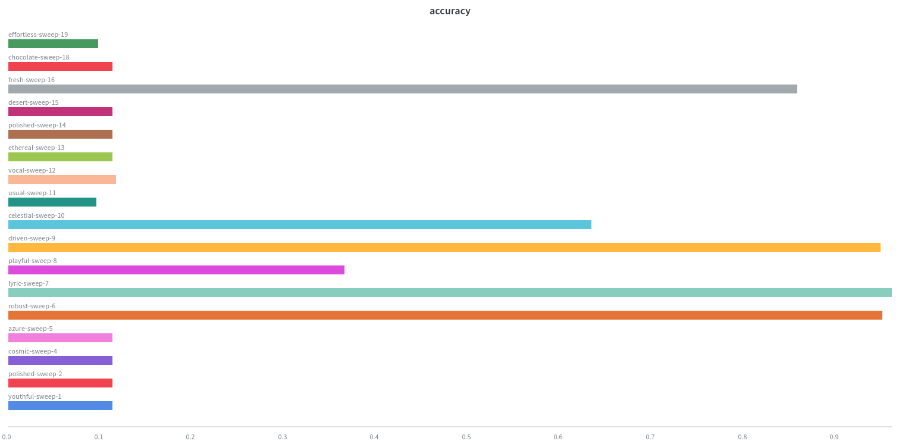
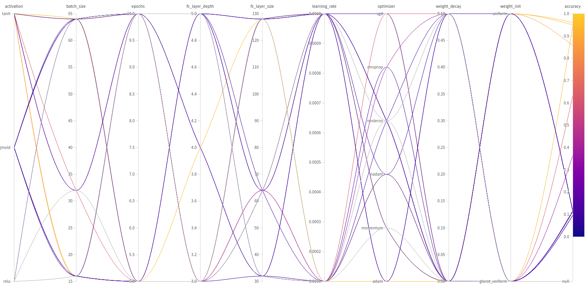
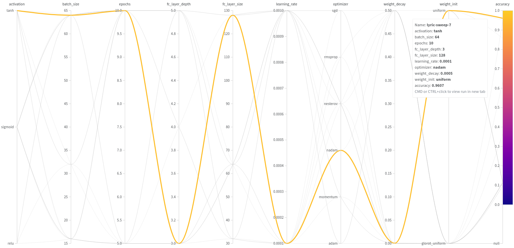

# Feed-Forward Neural Networks for Classification

The _notebook_ (`log_reg_nn_compare.ipynb`) contains the main orchestrating code.
There are three helper files containing the actual code for the neural networks:

- `shallow_nn.py`: Shallow Neural Network
- `nn_cv`: Configurable Feed-Forward Network
- `config.py`: Configuration for wandb

## Results
In my particular run, I got an accuracy of **0.92** with the **Logistic Regression** baseline model. I got **0.9** accuracy with the **Shallow Neural Net**, and I got an accuracy of **0.96** with the **Deep Neural Network** with **Sweeps**.

>_More info in the notebook_

## Wandb Sweep
The sweep dashboard for my particular run showed these results:

#### Run Accuracies

#### Sweep Results (Using Bayesian Method)

#### Optimal Hyperparameters

