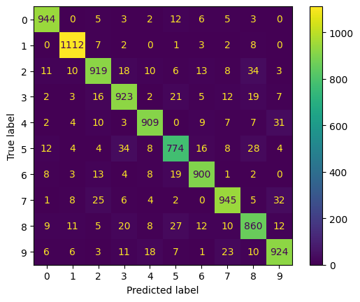
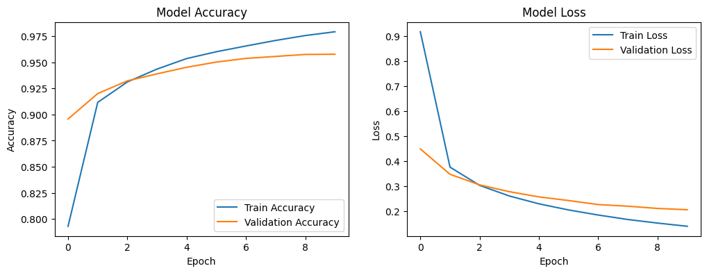
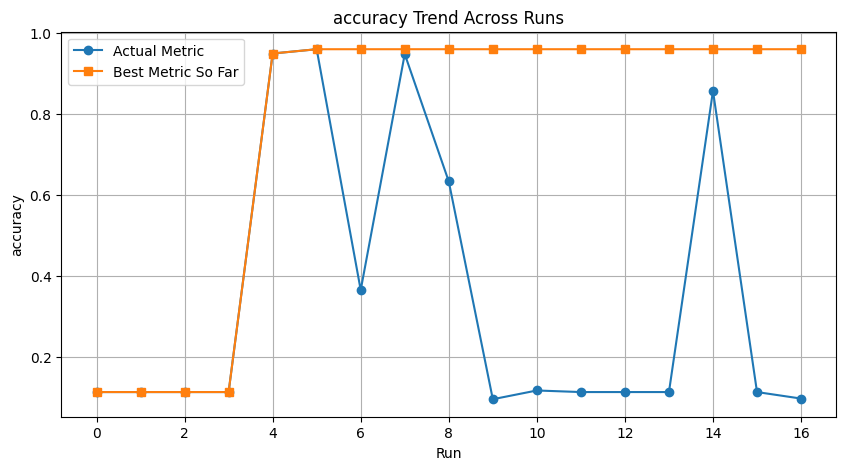
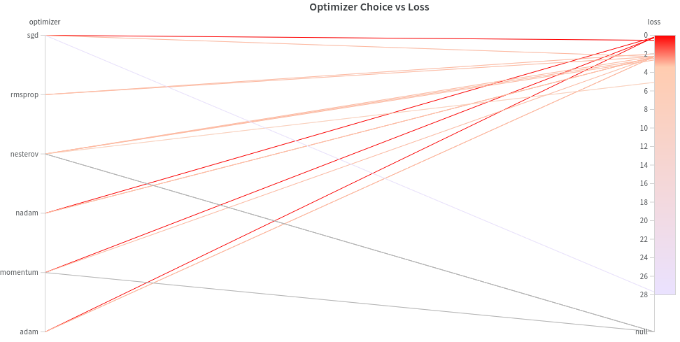
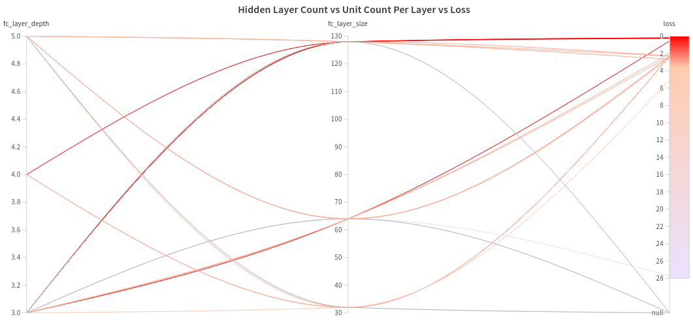
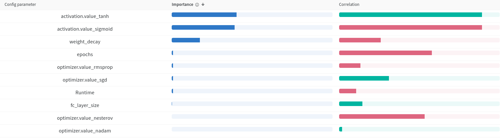
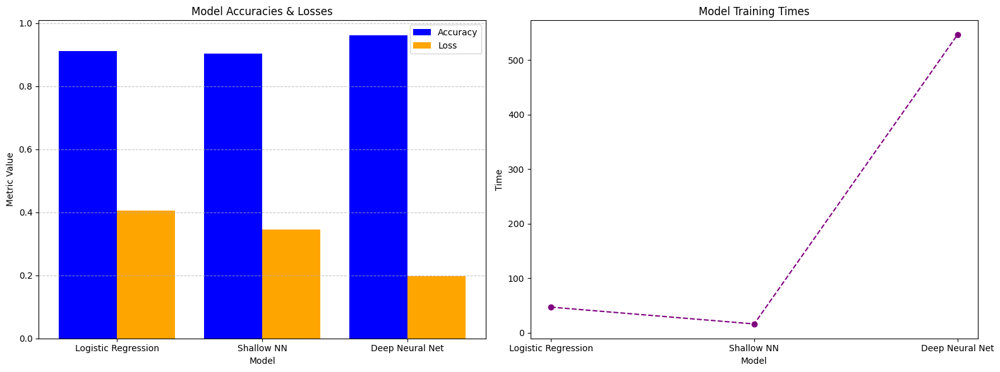

# Feed-Forward Neural Networks for Classification

The _notebook_ (`log_reg_nn_compare.ipynb`) contains the main orchestrating code.
There are three helper files containing the actual code for the neural networks:

- `shallow_nn.py`: Shallow Neural Network
- `nn_cv.py`: Configurable Feed-Forward Network
- `config.py`: Configuration for wandb

## Experimentation

Experiment was conducted in three stages. _Data Preprocessing_ was minimal. The data was first _randomized_ and then _flattened_.

**Dataset of _70000_ rows** was split into:
|Type        |Sample Count|
|------------|------------|
|Train       | 50000      |
|Test        | 10000      |
|Validation  | 10000      |

**Standard Scaler** was then applied to the input features.

### Logistic Regression Baseline
With Logistic Regression I got an accuracy of
<b style="font-size:24px">0.92</b>

The Confusion Matrix obtained from the test data:

### Shallow Neural Network
The output variable $[0,9]$ was _one-hot encoded_.

The shallow model resulted in an accuracy of
<b style="font-size:24px">0.9</b>

### Deep Neural Network
After hyper-paramter tuning, I got an accuracy of
<b style="font-size:24px">0.96</b>

#### Accuracy and Loss Trend with Epochs of the Best Model

For hyper-parameter tuning, **Wandb** was used with the given configuration options:
| Parameter         | Values/Setting                                      |
|-------------------|-----------------------------------------------------|
| activations       | sigmoid, tanh, relu                                 |
| optimizers        | sgd, adam, momentum, nesterov, rmsprop, nadam       |
| epochs            | 5, 10                                               |
| learning_rates    | 0.001, 0.0001                                       |
| batch_sizes       | 16, 32, 64                                          |
| fc_layer_sizes    | 32, 64, 128                                         |
| fc_layer_depths   | 3, 4, 5                                             |
| weight_decays     | 0, 0.0005, 0.5                                      |
| weight_inits      | uniform, glorot_uniform                             |

**Bayesian Optimization** method used for sweeping through the various hyper-parameter configurations quickly in about **20 runs**.

>_More info in the notebook_

The sweep dashboard for my particular run showed these results:

#### Run Accuracies

#### Sweep Results (Using Bayesian Method)

`null` here means that the run was skipped due to incompatible configuration.
#### Optimal Hyperparameters

#### Sweep Accuracy Trend

Based on the the sweep result, the best hyper parameters were:

|Hyper-parameter   |Value  |
|------------------|-------|
|Activation        |tanh   |
|Batch Size        |64     |
|Epochs            |10     |
|Hidden Layer Count|3      |
|Units Per Layer   |128    |
|Learning Rate     |0.0001 |
|Optimizer         |nadam  |
|Weight Decay      |0.0005 |
|Weight Init       |Random |

We can see how important certain parameters are to achieving minimum loss:

#### Optimizer Choice

We see that momentum, adam and nadam provide the best results. With **nadam** coming out on top for our experiment.

#### Number of Hidden Layers and Units Per Layer

We observe that _higher number of hidden layers don't necessarily give better results_. Here a depth of **3 layers** provide the best result. We also observe that higher neuron count per layer generaly contributes to better results. In our case the max of **128 units per layer** results in least loss.

### Hyper-Parameter Importance
Using wandb sweeps we can visualise the importance and correlation of hyper-parameters and their values that contribute to better accuracy.

## Model Comparison

We see that a poorly configured _Shallow Neural Net (non-linear)_ performs only marginally worse than our baseline _linear model_ which is _Logistic Regression_. A properly configured _Deep Neural Net_ performs much better than our baseline, with potential for even better results with more tuning runs.
